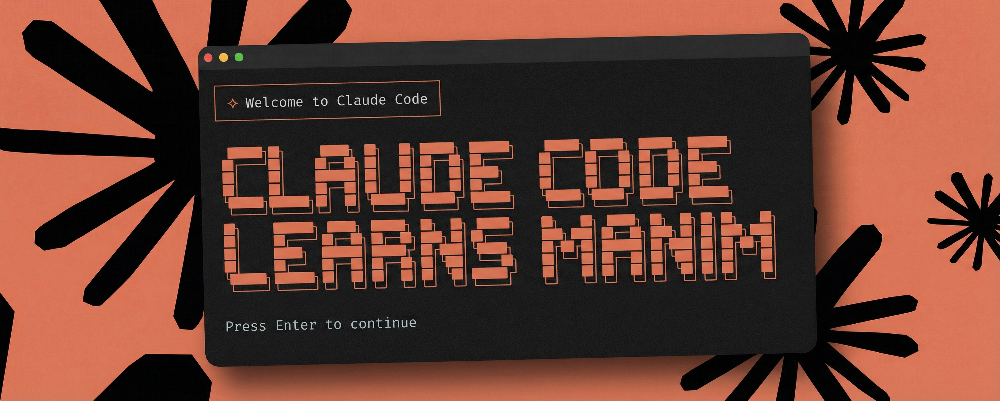

<p align="center">
  
</p>

# Math-To-Manim

<div align="center">

<!-- Core Requirements -->
[](https://www.python.org/)
[](LICENSE)
[](https://ffmpeg.org/)
[](https://www.manim.community/)
[](https://github.com/HarleyCoops/Math-To-Manim)

<!-- AI Models / LLMs -->
[](https://www.anthropic.com)
[](https://deepmind.google/technologies/gemini/)
[](https://kimi.moonshot.cn/)
[](https://www.deepseek.com/)
[](https://x.ai/)

</div>

> **January 29, 2026** - The **Kimi Agent pipeline has been upgraded from K2 Thinking to the K2.5 Swarm architecture**. This brings significant improvements to chain-of-thought reasoning and multi-agent coordination. If you've used the Kimi pipeline before, I encourage you to give this new version a try!

---

## Claude Code Learns Manim

**Use Math-To-Manim directly in Claude Code** — no setup required. Just install the skill and start creating animations with natural language.

### Quick Install

```bash
# Clone and run with the skill
git clone https://github.com/HarleyCoops/Math-To-Manim.git
claude --plugin-dir ./Math-To-Manim/skill
```

### What You Can Do

Once installed, just ask Claude:

- *"Create a math animation about the Fourier transform"*
- *"Animate how neural networks learn"*
- *"Generate Manim code explaining quantum entanglement"*

Claude will automatically use the **six-agent reverse knowledge tree pipeline** to:

1. **Analyze** your concept and extract the core topic
2. **Discover** prerequisites recursively (*"What must I understand BEFORE this?"*)
3. **Enrich** each concept with LaTeX equations and definitions
4. **Design** visual specifications (colors, animations, timing)
5. **Compose** a 2000+ token verbose prompt
6. **Generate** working Manim Python code

### Why This Matters

No training data. No examples needed. Pure LLM reasoning builds pedagogically sound animations that flow from foundations to advanced topics.

<details>
<summary><b>Skill Directory Structure</b></summary>

```
skill/
├── .claude-plugin/plugin.json
└── skills/math-to-manim/
    ├── SKILL.md                       # Core workflow definition
    ├── references/                    # Detailed documentation
    │   ├── reverse-knowledge-tree.md  # Algorithm deep-dive
    │   ├── agent-system-prompts.md    # All 6 agent prompts
    │   ├── verbose-prompt-format.md   # 2000+ token template
    │   └── manim-code-patterns.md     # Code generation patterns
    └── examples/
        └── pythagorean-theorem/       # Complete workflow example
```

</details>

> **Requirements**: [Claude Code CLI](https://claude.ai/code) + Python 3.10+ + Manim

---

## See It In Action

<div align="center">

**Brownian Motion: From Pollen to Portfolio**


*A journey from Robert Brown's microscope to Einstein's heat equation, arriving at the Black-Scholes model for financial options pricing.*

---

**Recursive Rhombicosidodecahedron**


*A fractal Archimedean solid where every vertex spawns another complete rhombicosidodecahedron.*

---

**The Hopf Fibration**


*Stereographic projection of S3 fibers creating nested tori - pure topology rendered in 3D.*

---

**The Whiskering Exchange**


*Visualizing the commutative property of 2-cell composition in higher category theory.*

</div>


## Three AI Pipelines, One Goal

Math-To-Manim offers **three distinct AI pipelines**. Choose based on your API access and preferences:

### Pipeline Comparison

| Feature | Gemini 3 (Google ADK) | Claude Sonnet 4.5 | Kimi K2.5 |
|:--------|:---------------------|:------------------|:--------|
| **Framework** | Google Agent Development Kit | Anthropic Agent SDK | OpenAI-compatible API |
| **Architecture** | Six-Agent Swarm | Six-Agent Pipeline | Six-Agent Swarm |
| **Strengths** | Complex topology, physics reasoning | Reliable code generation, recursion | Chain-of-thought, multi-agent coordination |
| **Best For** | Advanced 3D math, Kerr metrics | General purpose, production use | LaTeX-heavy explanations, structured reasoning |
| **Setup Complexity** | Moderate | Simple | Simple |

---

## Pipeline 1: Google Gemini 3 (ADK)

**Location**: `Gemini3/`

The Gemini pipeline uses the **Google Agent Development Kit** with a six-agent swarm architecture. Each agent is a specialist with a specific role in the animation generation process.

### How It Works

![Gemini Pipeline Architecture](https://mermaid.ink/img/Z3JhcGggVEQKICAgIFVzZXJQcm9tcHRbVXNlciBQcm9tcHRdIC0tPiBDQQogICAgCiAgICBDQVsiPGI+MS4gQ29uY2VwdEFuYWx5emVyPC9iPjxici8+RGVjb25zdHJ1Y3RzIHByb21wdCBpbnRvOjxici8+LSBDb3JlIGNvbmNlcHQ8YnIvPi0gVGFyZ2V0IGF1ZGllbmNlPGJyLz4tIERpZmZpY3VsdHkgbGV2ZWw8YnIvPi0gTWF0aGVtYXRpY2FsIGRvbWFpbiJdCiAgICAKICAgIENBIC0tPiBQRQogICAgUEVbIjxiPjIuIFByZXJlcXVpc2l0ZUV4cGxvcmVyPC9iPjxici8+QnVpbGRzIGtub3dsZWRnZSBEQUc6PGJyLz4nV2hhdCBtdXN0IGJlIHVuZGVyc3Rvb2QgQkVGT1JFIFg/Jzxici8+UmVjdXJzaXZlbHkgZGlzY292ZXJzIGRlcGVuZGVuY2llcyJdCiAgICAKICAgIFBFIC0tPiBNRQogICAgTUVbIjxiPjMuIE1hdGhlbWF0aWNhbEVucmljaGVyPC9iPjxici8+QWRkcyB0byBlYWNoIG5vZGU6PGJyLz4tIExhVGVYIGRlZmluaXRpb25zPGJyLz4tIEtleSBlcXVhdGlvbnM8YnIvPi0gVGhlb3JlbXMvcGh5c2ljYWwgbGF3cyJdCiAgICAKICAgIE1FIC0tPiBWRAogICAgVkRbIjxiPjQuIFZpc3VhbERlc2lnbmVyPC9iPjxici8+RGVzaWducyB1c2luZyBNYW5pbSBwcmltaXRpdmVzOjxici8+LSBWaXN1YWwgbWV0YXBob3JzIChzcGhlcmUgPSBwYXJ0aWNsZSk8YnIvPi0gQ2FtZXJhIG1vdmVtZW50czxici8+LSBDb2xvciBwYWxldHRlIChoZXggY29kZXMpPGJyLz4tIFRyYW5zaXRpb25zIl0KICAgIAogICAgVkQgLS0+IE5DCiAgICBOQ1siPGI+NS4gTmFycmF0aXZlQ29tcG9zZXI8L2I+PGJyLz5XZWF2ZXMgMjAwMCsgdG9rZW4gdmVyYm9zZSBwcm9tcHQ6PGJyLz4tIEV4YWN0IExhVGVYIHN0cmluZ3M8YnIvPi0gQW5pbWF0aW9uIHRpbWluZzxici8+LSBTY2VuZS1ieS1zY2VuZSBkZXNjcmlwdGlvbiJdCiAgICAKICAgIE5DIC0tPiBDRwogICAgQ0dbIjxiPjYuIENvZGVHZW5lcmF0b3I8L2I+PGJyLz5Qcm9kdWNlcyBleGVjdXRhYmxlIE1hbmltIGNvZGU6PGJyLz4tIFRocmVlRFNjZW5lIHdpdGggY2FtZXJhIG1vdmVtZW50czxici8+LSBDb3JyZWN0IExhVGVYIHJlbmRlcmluZzxici8+LSBObyBleHRlcm5hbCBhc3NldHMgcmVxdWlyZWQiXQoKICAgIHN0eWxlIENBIGZpbGw6I2UxZjVmZSxzdHJva2U6IzAxNTc5YixzdHJva2Utd2lkdGg6MnB4LGNvbG9yOmJsYWNrLGFsaWduOmxlZnQKICAgIHN0eWxlIFBFIGZpbGw6I2ZmZjljNCxzdHJva2U6I2ZiYzAyZCxzdHJva2Utd2lkdGg6MnB4LGNvbG9yOmJsYWNrLGFsaWduOmxlZnQKICAgIHN0eWxlIE1FIGZpbGw6I2UwZjJmMSxzdHJva2U6IzAwNjk1YyxzdHJva2Utd2lkdGg6MnB4LGNvbG9yOmJsYWNrLGFsaWduOmxlZnQKICAgIHN0eWxlIFZEIGZpbGw6I2YzZTVmNSxzdHJva2U6Izg4MGU0ZixzdHJva2Utd2lkdGg6MnB4LGNvbG9yOmJsYWNrLGFsaWduOmxlZnQKICAgIHN0eWxlIE5DIGZpbGw6I2ZmZWJlZSxzdHJva2U6I2I3MWMxYyxzdHJva2Utd2lkdGg6MnB4LGNvbG9yOmJsYWNrLGFsaWduOmxlZnQKICAgIHN0eWxlIENHIGZpbGw6I2YxZjhlOSxzdHJva2U6IzMzNjkxZSxzdHJva2Utd2lkdGg6MnB4LGNvbG9yOmJsYWNrLGFsaWduOmxlZnQK)

### Quick Start

```bash
# Set API key
echo "GOOGLE_API_KEY=your_key_here" >> .env

# Run the pipeline
python Gemini3/run_pipeline.py "Explain the Hopf Fibration"
```

### Key Files

- `Gemini3/run_pipeline.py` - Entry point
- `Gemini3/src/agents.py` - Agent definitions with system prompts
- `Gemini3/src/pipeline.py` - Orchestration logic
- `Gemini3/docs/GOOGLE_ADK_AGENTS.md` - Full documentation

---

## Pipeline 2: Claude Sonnet 4.5 (Anthropic SDK)

**Location**: `src/`

The Claude pipeline uses the **Anthropic Agent SDK** with automatic context management and built-in tools.

### How It Works

![Claude Pipeline Architecture](https://mermaid.ink/img/Z3JhcGggVEQKICAgIFVzZXJQcm9tcHRbVXNlciBQcm9tcHRdIC0tPiBDQQogICAgCiAgICBDQVsiPGI+MS4gQ29uY2VwdEFuYWx5emVyPC9iPjxici8+UGFyc2VzIHByb21wdCwgaWRlbnRpZmllczo8YnIvPi0gQ29yZSBjb25jZXB0PGJyLz4tIERvbWFpbiAocGh5c2ljcywgbWF0aCwgQ1MpPGJyLz4tIFZpc3VhbGl6YXRpb24gYXBwcm9hY2giXQogICAgCiAgICBDQSAtLT4gUEUKICAgIFBFWyI8Yj4yLiBQcmVyZXF1aXNpdGVFeHBsb3JlcjwvYj48YnIvPlRIRSBLRVkgSU5OT1ZBVElPTjo8YnIvPlJlY3Vyc2l2ZWx5IGFza3MgJ1doYXQgYmVmb3JlIFg/Jzxici8+QnVpbGRzIGNvbXBsZXRlIGtub3dsZWRnZSB0cmVlPGJyLz5JZGVudGlmaWVzIGZvdW5kYXRpb24gY29uY2VwdHMiXQogICAgCiAgICBQRSAtLT4gTUUKICAgIE1FWyI8Yj4zLiBNYXRoZW1hdGljYWxFbnJpY2hlcjwvYj48YnIvPkVuc3VyZXMgbWF0aGVtYXRpY2FsIHJpZ29yOjxici8+LSBMYVRlWCBmb3IgZXZlcnkgZXF1YXRpb248YnIvPi0gQ29uc2lzdGVudCBub3RhdGlvbjxici8+LSBMaW5rcyBmb3JtdWxhcyB0byB2aXN1YWxzIl0KICAgIAogICAgTUUgLS0+IFZECiAgICBWRFsiPGI+NC4gVmlzdWFsRGVzaWduZXI8L2I+PGJyLz5TcGVjaWZpZXMgZXhhY3QgY2luZW1hdG9ncmFwaHk6PGJyLz4tIENhbWVyYSBhbmdsZXMgYW5kIG1vdmVtZW50czxici8+LSBDb2xvciBzY2hlbWVzIHdpdGggbWVhbmluZzxici8+LSBUaW1pbmcgYW5kIHRyYW5zaXRpb25zIl0KICAgIAogICAgVkQgLS0+IE5DCiAgICBOQ1siPGI+NS4gTmFycmF0aXZlQ29tcG9zZXI8L2I+PGJyLz5XYWxrcyB0cmVlIGZyb20gZm91bmRhdGlvbi0+dGFyZ2V0Ojxici8+LSAyMDAwKyB0b2tlbiB2ZXJib3NlIHByb21wdDxici8+LSBOYXJyYXRpdmUgYXJjIHRocm91Z2ggY29uY2VwdHMiXQogICAgCiAgICBOQyAtLT4gQ0cKICAgIENHWyI8Yj42LiBDb2RlR2VuZXJhdG9yPC9iPjxici8VHJhbnNsYXRlcyB0byBNYW5pbTo8YnIvPi0gV29ya2luZyBQeXRob24gc2NlbmVzPGJyLz4tIEhhbmRsZXMgTGFUZVggcmVuZGVyaW5nPGJyLz4tIDNEIGNhbWVyYSBtb3ZlbWVudHMiXQoKICAgIHN0eWxlIENBIGZpbGw6I2UxZjVmZSxzdHJva2U6IzAxNTc5YixzdHJva2Utd2lkdGg6MnB4LGNvbG9yOmJsYWNrLGFsaWduOmxlZnQKICAgIHN0eWxlIFBFIGZpbGw6I2ZmZjljNCxzdHJva2U6I2ZiYzAyZCxzdHJva2Utd2lkdGg6MnB4LGNvbG9yOmJsYWNrLGFsaWduOmxlZnQKICAgIHN0eWxlIE1FIGZpbGw6I2UwZjJmMSxzdHJva2U6IzAwNjk1YyxzdHJva2Utd2lkdGg6MnB4LGNvbG9yOmJsYWNrLGFsaWduOmxlZnQKICAgIHN0eWxlIFZEIGZpbGw6I2YzZTVmNSxzdHJva2U6Izg4MGU0ZixzdHJva2Utd2lkdGg6MnB4LGNvbG9yOmJsYWNrLGFsaWduOmxlZnQKICAgIHN0eWxlIE5DIGZpbGw6I2ZmZWJlZSxzdHJva2U6I2I3MWMxYyxzdHJva2Utd2lkdGg6MnB4LGNvbG9yOmJsYWNrLGFsaWduOmxlZnQKICAgIHN0eWxlIENHIGZpbGw6I2YxZjhlOSxzdHJva2U6IzMzNjkxZSxzdHJva2Utd2lkdGg6MnB4LGNvbG9yOmJsYWNrLGFsaWduOmxlZnQK)


### Key Files

- `src/app_claude.py` - Gradio UI entry point
- `src/agents/prerequisite_explorer_claude.py` - Claude SDK agent
- `docs/ARCHITECTURE.md` - System design details

---

## Pipeline 3: Kimi K2.5 Swarm

**Location**: `KimiK2.5Swarm/`

The Kimi pipeline uses Moonshot AI's **K2.5 Swarm architecture** with an OpenAI-compatible API, six-agent coordination, and enhanced chain-of-thought reasoning.

### How It Works

![Kimi Pipeline Architecture](https://mermaid.ink/img/Z3JhcGggVEQKICAgIFVzZXJQcm9tcHRbVXNlciBQcm9tcHRdIC0tPiBLUEUKICAgIAogICAgS1BFWyI8Yj4xLiBLaW1pUHJlcmVxdWlzaXRlRXhwbG9yZXI8L2I+PGJyLz5CdWlsZHMga25vd2xlZGdlIHRyZWU6PGJyLz4tIFRvb2wtY2FsbGluZyBmb3Igc3RydWN0dXJlZCBvdXRwdXQ8YnIvPi0gVGhpbmtpbmcgbW9kZSBzaG93cyByZWFzb25pbmc8YnIvPi0gUmVjdXJzaXZlIGRlcGVuZGVuY3kgZGlzY292ZXJ5Il0KICAgIAogICAgS1BFIC0tPiBNRQogICAgTUVbIjxiPjIuIE1hdGhlbWF0aWNhbEVucmljaG1lbnQ8L2I+PGJyLz5UaHJlZS1zdGFnZSBlbnJpY2htZW50Ojxici8+LSBNYXRoIEVucmljaGVyOiBMYVRlWCBlcXVhdGlvbnMsIGRlZmluaXRpb25zPGJyLz4tIFZpc3VhbCBEZXNpZ25lcjogRGVzY3JpcHRpb25zIChub3QgTWFuaW0gY2xhc3Nlcyk8YnIvPi0gTmFycmF0aXZlIENvbXBvc2VyOiBDb25uZWN0cyBldmVyeXRoaW5nIl0KICAgIAogICAgTUUgLS0+IENHCiAgICBDR1siPGI+My4gQ29kZUdlbmVyYXRpb248L2I+PGJyLz5GaW5hbCBNYW5pbSBjb2RlOjxici8+LSBGb2N1c2VzIG9uIExhVGVYIHJlbmRlcmluZzxici8+LSBMZXRzIE1hbmltIGhhbmRsZSB2aXN1YWxzPGJyLz4tIFRvb2wgYWRhcHRlciBmb3IgdmVyYm9zZSBpbnN0cnVjdGlvbnMiXQoKICAgIHN0eWxlIEtQRSBmaWxsOiNmZmY5YzQsc3Ryb2tlOiNmYmMwMmQsc3Ryb2tlLXdpZHRoOjJweCxjb2xvcjpibGFjayxhbGlnbjpsZWZ0CiAgICBzdHlsZSBNRSBmaWxsOiNlMGYyZjEsc3Ryb2tlOiMwMDY5NWMsc3Ryb2tlLXdpZHRoOjJweCxjb2xvcjpibGFjayxhbGlnbjpsZWZ0CiAgICBzdHlsZSBDRyBmaWxsOiNmMWY4ZTksc3Ryb2tlOiMzMzY5MWUsc3Ryb2tlLXdpZHRoOjJweCxjb2xvcjpibGFjayxhbGlnbjpsZWZ0Cg==)

### Quick Start

```bash
# Set API key
echo "MOONSHOT_API_KEY=your_key_here" >> .env

# Run prerequisite exploration
python KimiK2.5Swarm/examples/test_kimi_integration.py

# Run full enrichment pipeline
python KimiK2.5Swarm/examples/run_enrichment_pipeline.py path/to/tree.json
```

### Key Files

- `KimiK2.5Swarm/kimi_client.py` - API client
- `KimiK2.5Swarm/agents/enrichment_chain.py` - Three-stage pipeline
- `KimiK2.5Swarm/README.md` - Complete documentation

---


## Installation

```bash
# Clone repository
git clone https://github.com/HarleyCoops/Math-To-Manim
cd Math-To-Manim

# Install dependencies
pip install -r requirements.txt

# Set up your preferred API key
echo "ANTHROPIC_API_KEY=your_key" >> .env    # For Claude
echo "GOOGLE_API_KEY=your_key" >> .env       # For Gemini
echo "MOONSHOT_API_KEY=your_key" >> .env     # For Kimi

# Install FFmpeg (required for video rendering)
# Windows: choco install ffmpeg
# Linux: sudo apt-get install ffmpeg
# macOS: brew install ffmpeg
```

---

## Run Example Animations

We have **55+ working examples** organized by topic:

```bash
# Physics - Black Hole Symphony
manim -pql examples/physics/black_hole_symphony.py BlackHoleSymphony

# Mathematics - Hopf Fibration
manim -pql examples/misc/epic_hopf.py HopfFibrationEpic

# Finance - Option Pricing
manim -pql examples/finance/optionskew.py OptionSkewScene

# Computer Science - Neural Networks
manim -pql examples/computer_science/machine_learning/AlexNet.py AlexNetScene
```

**Flags**: `-p` preview, `-q` quality (`l` low, `m` medium, `h` high, `k` 4K)

Browse all examples: [docs/EXAMPLES.md](docs/EXAMPLES.md)

---

## Repository Structure

```
Math-To-Manim/
|
+-- .claude/plugins/math-to-manim/  # Claude Code Skill
|
+-- src/                    # Claude Sonnet 4.5 pipeline
|   +-- agents/             # Agent implementations
|   +-- app_claude.py       # Gradio UI
|
+-- Gemini3/                # Google Gemini 3 pipeline
|   +-- src/                # Agent definitions
|   +-- docs/               # Gemini-specific docs
|   +-- run_pipeline.py     # Entry point
|
+-- KimiK2.5Swarm/          # Kimi K2.5 Swarm pipeline
|   +-- agents/             # Enrichment chain
|   +-- examples/           # Usage examples
|
+-- examples/               # 55+ working animations
|   +-- physics/            # Quantum, gravity, particles
|   +-- mathematics/        # Geometry, topology, analysis
|   +-- computer_science/   # ML, algorithms
|   +-- cosmology/          # Cosmic evolution
|   +-- finance/            # Option pricing
|
+-- docs/                   # Documentation
+-- tests/                  # Test suite
+-- tools/                  # Utility scripts
```

---

## Why LaTeX-Rich Prompting Works

### The Problem with Vague Prompts

```
"Create an animation showing quantum field theory"
```
**Result**: Generic, incorrect, or broken code.

### The Solution: Verbose LaTeX Prompts

```
"Begin with Minkowski spacetime showing the metric:

$$ds^2 = -c^2 dt^2 + dx^2 + dy^2 + dz^2$$

Each component highlighted in different hues. Introduce the QED Lagrangian:

$$\mathcal{L}_{\text{QED}} = \bar{\psi}(i \gamma^\mu D_\mu - m)\psi - \tfrac{1}{4}F_{\mu\nu}F^{\mu\nu}$$

with Dirac spinor $\psi$ in orange, covariant derivative $D_\mu$ in green..."
```
**Result**: Perfect animations with correct LaTeX, camera movements, and timing.

**Our agents generate these verbose prompts automatically** by walking the knowledge tree.

---

## Common Pitfalls (And How We Solve Them)

| Problem | Traditional Approach | Our Solution |
|:--------|:--------------------|:-------------|
| **LaTeX Errors** | Hope for the best | Verbose prompts show exact formulas |
| **Vague Cinematography** | "Show quantum field" | Specify colors, angles, timing |
| **Missing Prerequisites** | Jump to advanced topics | Recursive dependency discovery |
| **Inconsistent Notation** | Mixed symbols | Mathematical enricher maintains consistency |

---

## Technical Requirements

- **Python**: 3.10+
- **API Key**: Anthropic, Google, or Moonshot
- **FFmpeg**: For video rendering
- **Manim Community**: v0.19.0
- **RAM**: 8GB minimum, 16GB recommended

---

## Contributing

We welcome contributions:

1. **Add Examples**: Create animations for new topics
2. **Improve Agents**: Enhance prerequisite discovery
3. **Fix Bugs**: Report and fix issues
4. **Documentation**: Improve guides

See [CONTRIBUTING.md](CONTRIBUTING.md) for guidelines.

---

## Documentation

- **[Claude Code Skill](docs/QUICK_START_GUIDE.md)** - Use Math-To-Manim in Claude Code
- [Reverse Knowledge Tree](docs/REVERSE_KNOWLEDGE_TREE.md) - Core innovation
- [Architecture](docs/ARCHITECTURE.md) - System design
- [Examples Catalog](docs/EXAMPLES.md) - All 55+ animations
- [Gemini Pipeline](Gemini3/docs/GOOGLE_ADK_AGENTS.md) - Google ADK details
- [Kimi Pipeline](KimiK2.5Swarm/README.md) - Moonshot AI integration
- [Quick Start Guide](docs/QUICK_START_GUIDE.md) - Get started fast

---

## License

MIT License - See [LICENSE](LICENSE)

---

## Acknowledgments

- **Manim Community** - Incredible animation framework
- **Anthropic** - Claude Sonnet 4.5 and Agent SDK
- **Google** - Gemini 3 and Agent Development Kit
- **Moonshot AI** - Kimi K2.5 Swarm architecture
- **1400+ Stargazers** - Thank you for the support!

---

<div align="center">

**Built with recursive reasoning, not training data.**

**Star this repo if you find it useful!**

[](https://www.star-history.com/#HarleyCoops/Math-To-Manim&type=date&legend=top-left)

</div>

